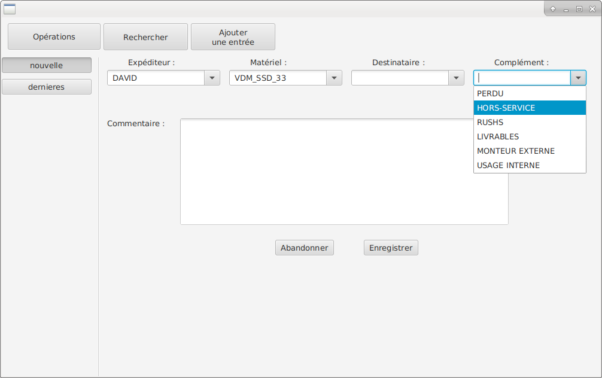
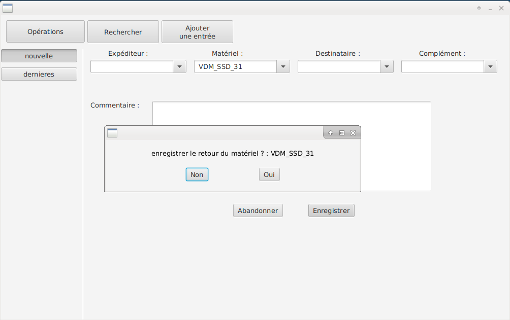
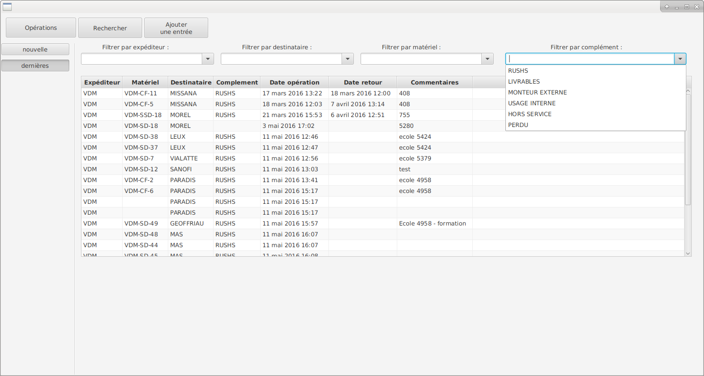
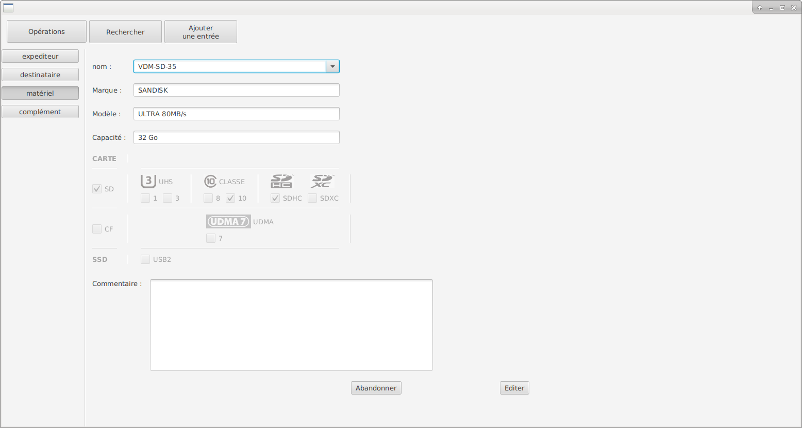

# VDM_StockFX
*interface pour le suivi de la circulation du matériel (JavaFX + MongoDB)*

####Interface de suivi du stock mis en circulation et d'aide à l'attribution cohérente du matériel :

- interface graphique activée par l'action de la douchette sur le code barre du matériel

- affichage de l'action appropriée : 
  - sortie du matériel (si le matériel est connu comme présent) 
  - retour du matériel (si le matériel est connu comme sorti) 
  - enregistrement du matériel (si le matériel est inconnu) 
  
- ajustement du contenu des listes déroulantes à la saisie

- des cartes inapropriées ne peuvent pas êtres affectées à des cadreurs qui attendent un autre modèle.
  
  
####enregistrement d'une sortie de matériel

####enregistrement d'un retour de matériel

####affichage des derniers mouvements

####mise à jour fiche matériel

